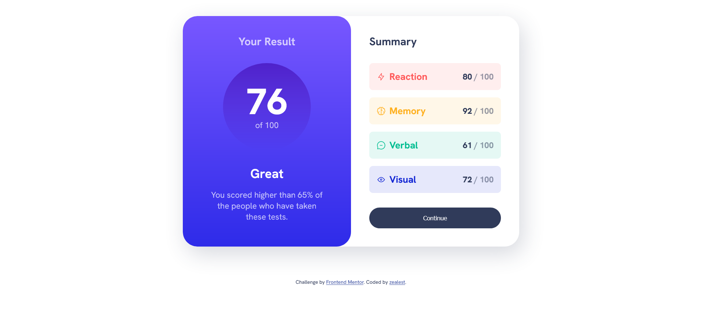

# Frontend Mentor - Product preview card component solution

This is my solution to the [Results summary component challenge on Frontend Mentor](https://www.frontendmentor.io/challenges/results-summary-component-CE_K6s0maV).

## Overview

### The challenge

Users should be able to:

- View the optimal layout depending on their device's screen size
- See hover and focus states for interactive elements

### Screenshot

### Links

- Results summary component challenge on [Frontend Mentor](https://www.frontendmentor.io/challenges/results-summary-component-CE_K6s0maV)
- [Live Site URL](https://zealest.github.io/__results-summary-component)

### Built with

- Semantic HTML5 markup
- CSS custom properties
- Flexbox
- CSS Grid

## Author

- Frontend Mentor - [@Zealest](https://www.frontendmentor.io/profile/Zealest)
- Twitter - [@1zealest](https://www.twitter.com/1zealest)
